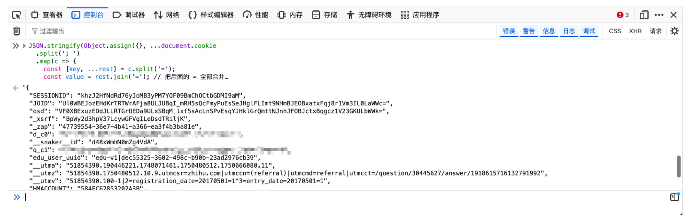

f12`console`运行：

```javascript
JSON.stringify(  
Object.assign(  
{},  
...document.cookie.split("; ").map((c) => {  
const [key, ...rest] = c.split("=");  
const value = rest.join("=");  
return { [key]: decodeURIComponent(value) };  
}),  
),  
null,  
2,  
);
```
返回值就是json字符串化了的结果。



参考文献：[登录知乎 \| Zhihu on Obsidian](https://zhihu.melonhu.cn/docs/%E5%BF%AB%E9%80%9F%E5%BC%80%E5%A7%8B/%E7%99%BB%E5%BD%95%E7%9F%A5%E4%B9%8E)