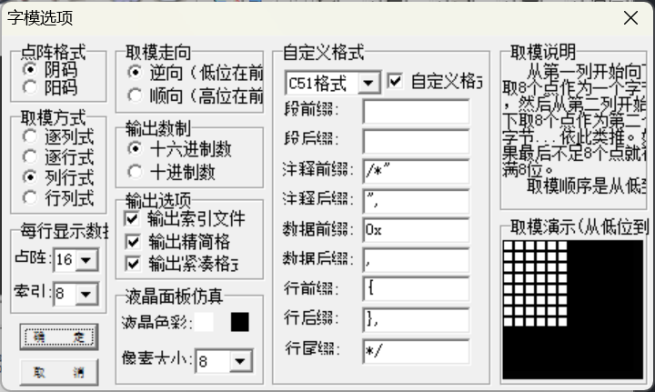
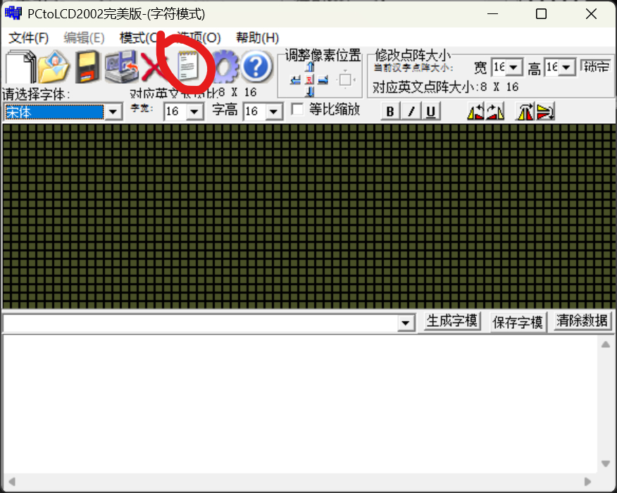

# 补充知识

unicode和utf-8不是一个东西。Unicode的0号平面（常用汉字在里面）使用两个字节表示一个汉字，例如`啊`是`U+554A`。

utf-8的汉字主要使用三个字节编码，但是keysking范式中采用四个字节（最后一个总是0x00）。

unicode和utf-8之间可以通过简单的$O(1)$的数学运算换算。

GB2312也是用两个字节表示一个汉字。有区位码、国标码、机内码三种形式，其中机内码是实际的储存形式。三者可以通过加减一个固定的偏移换算。

GB2312与utf-8之间没有固定的数学规律，只能通过查表法换算。

zh_font_manager这套管理范式的大致数据流：

硬编码一张utf转gb2312机内码的映射表，从字符串字面量的utf码可以查出gb2312进而通过一个特殊公式计算出字库的offset读取flash显示即可。

# 生成字库文件

首先，介绍一下`uni2gb_table.h`的来源（虽然我已经生成好了）

我通过`gen_table.py`生成utf转gb2312内码的映射表`uni2gb_table.h`。

```python
# gen_table.py
# 该脚本生成 Unicode 到 GB2312 的映射表 C 语言头文件

def generate_c_table():
    table = []
    
    # GB2312 范围：
    # 区: 01-94, 位: 01-94
    # 实际常用汉字在 16-55区 (一级汉字), 56-87区 (二级汉字)
    # 这里我们遍历所有可能的 GB2312 码点
    for row in range(0xA1, 0xF8): # 区
        for col in range(0xA1, 0xFF): # 位
            gb_val = (row << 8) | col
            gb_bytes = bytes([row, col])
            
            try:
                # 尝试解码为 Unicode
                uni_str = gb_bytes.decode('gb2312')
                uni_val = ord(uni_str)
                table.append((uni_val, gb_val))
            except:
                continue

    # 按照 Unicode 排序，以便在 C 代码中进行二分查找
    table.sort(key=lambda x: x[0])

    # 生成 C 头文件
    with open("uni2gb_table.h", "w", encoding="utf-8") as f:
        f.write("#ifndef UNI2GB_TABLE_H\n")
        f.write("#define UNI2GB_TABLE_H\n\n")
        f.write("#include <stdint.h>\n\n")
        f.write("typedef struct {\n")
        f.write("    uint16_t unicode;\n")
        f.write("    uint16_t gb2312;\n")
        f.write("} UniGbMapping;\n\n")
        
        f.write(f"// 共 {len(table)} 个字符，按 Unicode 排序\n")
        f.write("const UniGbMapping cp_uni2gb[] = {\n")
        
        for uni, gb in table:
            f.write(f"    {{0x{uni:04X}, 0x{gb:04X}}},\n")
            
        f.write("};\n\n")
        f.write(f"#define UNI2GB_TABLE_SIZE {len(table)}\n\n")
        f.write("#endif\n")

    print(f"生成完成: uni2gb_table.h, 包含 {len(table)} 个条目。")

if __name__ == "__main__":
    generate_c_table()

```

然后利用[PCtoLCD2002完美版](https://wwaml.lanzoul.com/il60O3hizuyd)（密码:byo9），设置如下参数：



然后输入适合的字体和字体尺寸。

> 对于8x8，我使用[“观致”字体](https://github.com/Angelic47/FontChinese7x7)（下载其中的`guanzhi.ttf`，或通过我的[云盘](https://wwaml.lanzoul.com/it3Mh3hizv6b)，密码:78qb）
> 
> 对于24x24，我选择系统自带的黑体（中易黑体）
> 
> 对于12x12以及16x16，我选择系统自带的宋体

之后点击这个按钮，选择“生成国标汉字库”：



这样就生成了四个 尺寸的二进制`.FON`文件，每个里面是裸的字模数据，按GB2312的顺序排列。

在Windows上使用cmd的`copy /b 8x8.FON+12x12.FON+16x16.FON+24x24.FON fonts.bin`命令将四个文件合并为一个`fonts.bin`，即得所用的字库。

# 烧写字库文件

在esp-idf工程根目录下新建`partition.csv`作为自定义分区表，同时在`menuconfig`中启用自定义分区表功能。

```csv
# Name,   Type, SubType, Offset,  Size, Flags
# Note: if you have increased the bootloader size, make sure to update the offsets to avoid overlap
nvs,      data, nvs,     ,        0x6000,
phy_init, data, phy,     ,        0x1000,
factory,  app,  factory, ,        2M,
fonts,    data, 0x40,    ,        0x110000,
```

`factory`的大小`2M`可根据自己的代码应用程序体积灵活调整，在保证能装得下程序的前提下稍微小一点（太大了的话烧录比较慢）

重点在最后一行，`fonts`的大小`0x110000`是根据`fonts.bin`文件的字节数（实际大小）向上取整至以0x1000（4KB）为对齐单位。

子类型`0x40`无所谓，你也可以取`0x41`等等。

之后在ESP-IDF Terminal中用如下的命令单独烧写字库。

```
parttool.py --port "COM9" write_partition --partition-name=fonts --input "fonts.bin"
```

其中COM9改成自己的端口号。