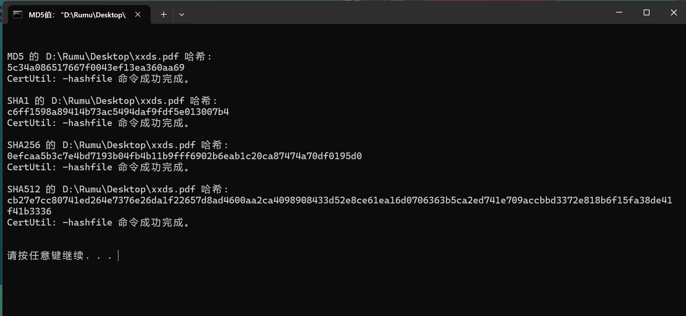

# 效果

右键文件：


运行后：



# 步骤

首先新建一个`md5.bat`文件，内容是

```bat
@echo off
title MD5值： %1
echo.
echo.
if exist %1 (
	for /f "delims=" %%i in (%1) do (
		if %%~zi gtr 0 (
			certutil -hashfile %1 MD5
			echo.
			certutil -hashfile %1 SHA1
			echo.
			certutil -hashfile %1 SHA256
			echo.
			certutil -hashfile %1 SHA512
		) else (
			echo 错误：文件大小为0，无法计算
		)
	)
) else (
	echo 错误：文件不存在
)
echo.
echo.
pause
```

保存，改成ANSI编码（不会的看[解决window的bat脚本执行出现中文乱码的问题 - 行走的思想 - 博客园](https://www.cnblogs.com/onelikeone/p/11965839.html)）

把它放在你喜欢的位置，例如我放在了`D:\Software\Ziptools\md5.bat`

然后新建一个`xxx.reg`文件，内容是（注意修改路径，因为我是`D:\Software\Ziptools\md5.bat`而你不一定是，注意双斜杠）

```
Windows Registry Editor Version 5.00

[HKEY_CLASSES_ROOT\*\shell\ShowMD5]
@="查看MD5"

[HKEY_CLASSES_ROOT\*\shell\ShowMD5\command]
@="D:\\Software\\Ziptools\\md5.bat \"%1\""
```

右键运行`xxx.reg`文件，之后重启`explorer.exe`(不会的看[这里](https://zhuanlan.zhihu.com/p/477779512))，就能看到右键有“查看MD5”了。